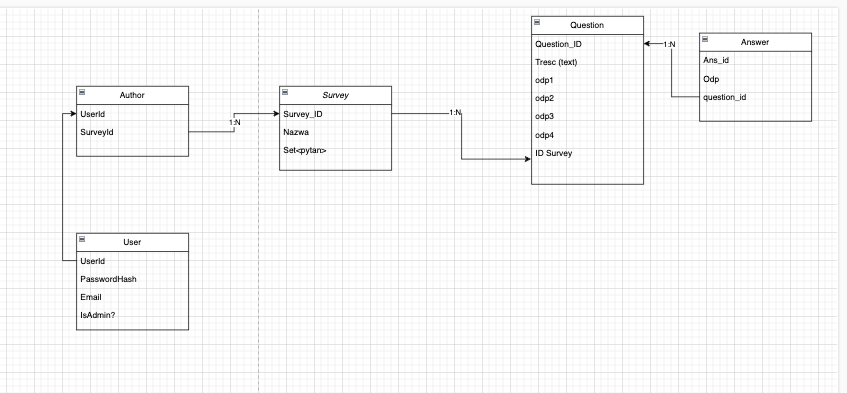

## Pre-start
 - https://www.docker.com/
 - https://nodejs.org/en

## Getting Started
1. npm install
2. docker-compose up (separate terminal)
3. create .env according to .env.template
4. npx prisma migrate deploy
5. npm run dev
6. http://localhost:3000

## Migration

 - npx prisma dev --name {Migration name}

## DB

